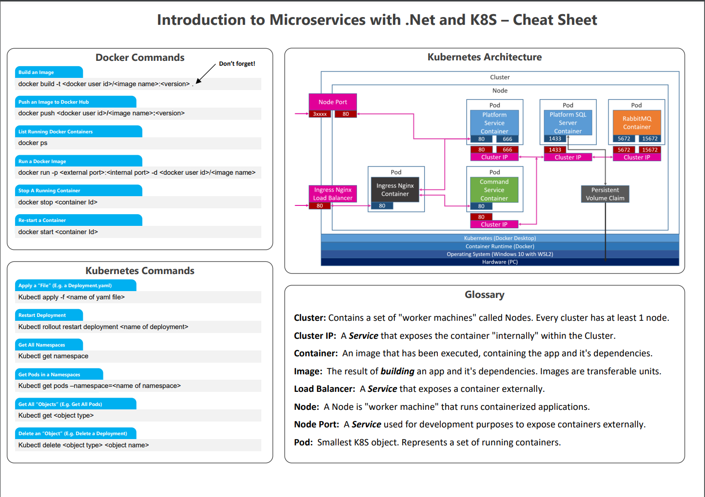

# Kubernetes Cheat Sheat

# Services

## Platform Service

## Commands Service

# Architecture

## Solution Architecture

## Platform Service Architecture

## Commands Service Architecture

## Kubernetes Architecture

## Guides

- [Dockerize Platform Service](Guides/Dockerize%20PlatformService.md)
- [Create Platforms Service Kubernetes Deployment](Guides/Create%20Platforms%20Service%20Kubernetes%20Deployment.md)
- [Create Platforms Service Node Port Service](Guides/Create%20Platforms%20Service%20Node%20Port.md)
- [Run Command Service in Kubernetes](Guides/Run%20Command%20Service%20in%20Kubernetes.md)
- [Deploy nginx Ingress Load Balancer](Guides/Deploy%20nginx%20Ingress%20Load%20Balancer.md)
- [Deploying MSSQL to Kubernetes](Guides/Deploying%20MSSQL%20to%20Kubernetes.md)
